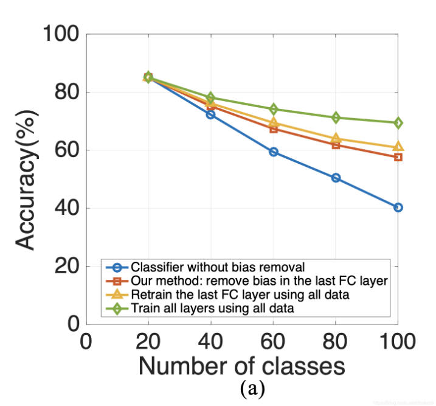

已完成
1. 修改整体逻辑
2. 跑通代码
3. 加入验证集
验证集每次从范例集（buffer）里取了10%，剩下90%加在了训练集里

待完成
2. 去看原文/其它论文的实验设计，观察验证集的数量和范例集的存储策略 
3. 对比实验结果
4. 再根据实验结果对代码做出一些修改调整

主要修改：
1.replay中的bic
主要参照https://github.com/sairin1202/BIC

2.core/trainer中：
(1)加入了一个stage2_train(self, epoch_idx, dataloader)，当输入方法是bic时会在train后再执行一个stage2_train，stage2_train执行的每一步对应bic model里的bias_observe。
stage2_train只在task_idx > 0 时执行。

(2)每个任务开始时，会把范例集划分成两部分，一部分加入到训练集中，一部分加入到验证集中，验证集提供给stage2(stage2_train)做训练，训练集提供给stage1做训练(_train)。

参数设置主要参照https://www.lamda.nju.edu.cn/zhoudw/file/cil_survey.pdf
还有部分修改详见https://github.com/zldscr0/GEM

日志：
v1：`log/bic-cifarresnet-epoch100-23-10-19-19-04-26.log`（暂时找不到了，因为忘记commit到库里了，后来被误删了）

|            | 20   | 40    | 60    | 80    | 100   |
| ---------- | ---- | ----- | ----- | ----- | ----- |
| 原文       | 0.84 | 0.747 | 0.679 | 0.613 | 0.567 |
| Ours（v1） | 0.63 | 0.515 | 0.410 | 0.320 | 0.26  |
|            | 0.82 |       |       |       |       |
|            |      |       |       |       |       |

关于结果的解释：

1. v1在没有实现bic这一模型的情况下可以达到很高的精度，原因是v1相当于是一个replay的算法，相当于下图里的蓝色部分，要实现的bic方法是橙色部分.

2. v1虽然精度很高，但是没有达到下图的精度，原因在于数据预处理，修改了数据的预处理变换后v1的精度可以提升很多.（详见https://github.com/zldscr0/GEM）

3. 

